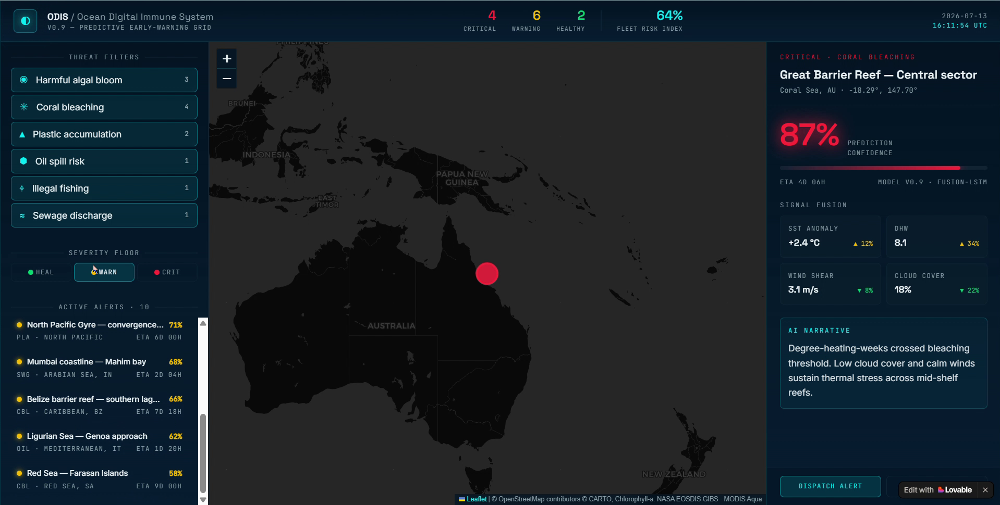
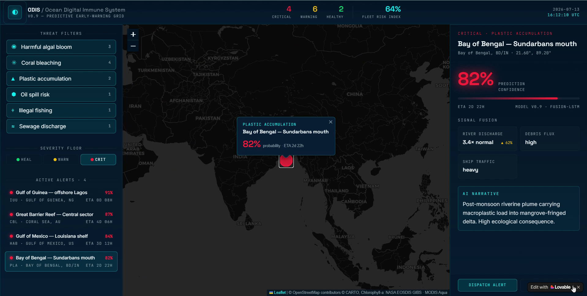
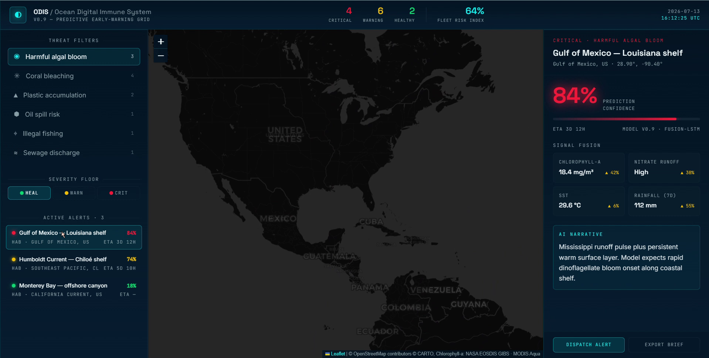
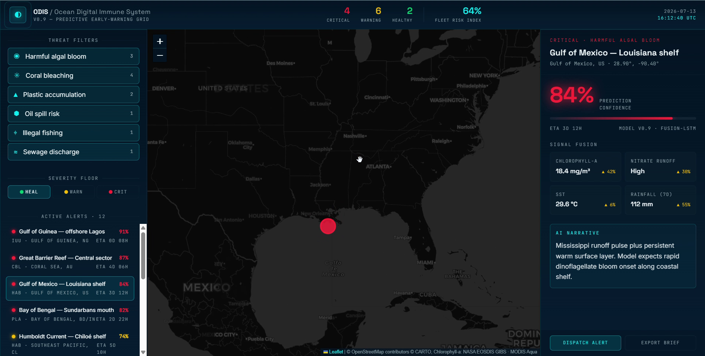

# ODIS – Ocean Digital Immune System

An AI-powered platform for monitoring marine pollution, visualizing ocean ecosystem health, and supporting environmental sustainability through interactive dashboards and intelligent analytics.

---

## Live Demo

https://odisbyaid-a.lovable.app/

---

## Project Overview

ODIS (Ocean Digital Immune System) is an intelligent web-based platform designed to assist in monitoring marine environments through interactive visualizations and environmental analytics.

The platform provides an intuitive dashboard for exploring pollution hotspots, understanding ocean health, and supporting data-driven conservation efforts. It demonstrates how modern web technologies and AI concepts can contribute to protecting marine ecosystems.

This project was developed as part of an academic initiative aligned with **United Nations Sustainable Development Goal 14 – Life Below Water**.

---

## Key Features

- Interactive global ocean map
- Marine pollution hotspot visualization
- Environmental analytics dashboard
- Ocean ecosystem monitoring
- Modern responsive user interface
- Fast and lightweight React application
- Dark mode dashboard
- Scalable project architecture

---

## Screenshots

### Home Dashboard

<!-- Replace the image below with your uploaded screenshot -->



---

### Interactive Ocean Map



---

### Analytics Dashboard



---

### Pollution Monitoring



---

## Technology Stack

### Frontend

- React
- TypeScript
- Vite
- Tailwind CSS
- shadcn/ui

### Development Tools

- Lovable
- Bun
- ESLint
- Prettier

---

## Project Structure

```text
ODIS-Ocean-Digital-Immune-System
│
├── public/
├── screenshots/
├── src/
│   ├── assets/
│   ├── components/
│   ├── hooks/
│   ├── lib/
│   ├── pages/
│   └── App.tsx
│
├── package.json
├── vite.config.ts
├── tsconfig.json
├── bun.lock
└── README.md
```

---

## Installation

Clone the repository

```bash
git clone https://github.com/Yaswanth-07-code/ODIS-Ocean-Digital-Immune-System.git
```

Move into the project folder

```bash
cd ODIS-Ocean-Digital-Immune-System
```

Install dependencies

```bash
npm install
```

or

```bash
bun install
```

Run the development server

```bash
npm run dev
```

or

```bash
bun dev
```

---

## Project Objective

The primary objective of ODIS is to develop an intelligent digital platform capable of monitoring marine pollution and presenting environmental insights through interactive visualizations.

The system demonstrates how AI-inspired approaches and data visualization techniques can improve awareness and support sustainable ocean conservation.

---

## Sustainable Development Goal (SDG)

This project contributes to:

**SDG 14 – Life Below Water**

Objectives supported by this project include:

- Reducing marine pollution awareness
- Protecting marine ecosystems
- Promoting sustainable ocean conservation
- Encouraging data-driven environmental decisions
- Improving public understanding of ocean health

---

## Future Enhancements

- AI-powered pollution detection using computer vision
- Satellite imagery integration
- Real-time ocean sensor integration
- Pollution prediction using machine learning
- Intelligent alert system
- Historical pollution analysis
- Marine biodiversity monitoring
- Mobile application

---

## Repository

GitHub Repository

https://github.com/Yaswanth-07-code/ODIS-Ocean-Digital-Immune-System

Live Website

https://odisbyaid-a.lovable.app/

---

## Contributors

## Contributors

- [@Yaswanth-07-code](https://github.com/Yaswanth-07-code)
- [@rohithmeka](https://github.com/rohithmeka)

---

## License

This project is intended for educational and research purposes.

MIT License.
